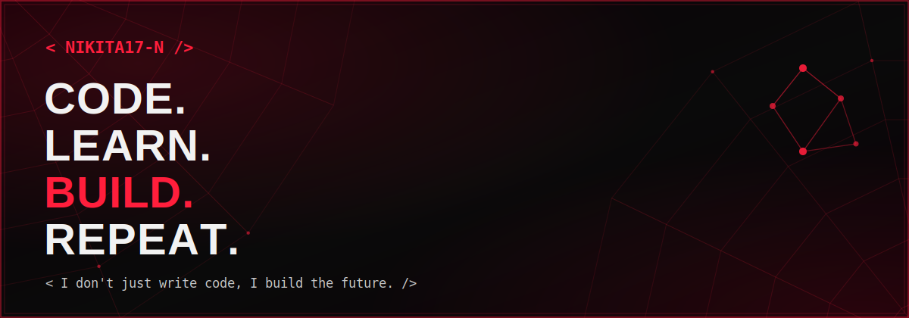

<div align="center">



<p>
  🕷️ &nbsp;&nbsp;&nbsp; <code>&lt;/&gt;</code> &nbsp;&nbsp;&nbsp; 🕸️
</p>

</div>

<table width="100%">
<tr><td>

### 🕷️ About Me

- 🧠 &nbsp;AI/ML Engineer
- 💻 &nbsp;Problem Solver
- 📚 &nbsp;Lifelong Learner
- 🚀 &nbsp;Turning Ideas into Intelligent Solutions

Always building. Always improving. **_Always shipping._**

</td></tr>
</table>

<div align="center">


</div>

<br>

### 🕷️ Tech Arsenal

<div align="center">

</div>

<br>

<table width="100%">
<tr>
<td width="58%" valign="top">

### 🕷️ GitHub Stats


</td>
<td width="42%" valign="top">

### 🔥 Streak


</td>
</tr>
</table>

<div align="center">

### 🕷️ Most Used Languages


</div>

### 🕷️ Contribution Graph

<div align="center">


_More contributions, more impact._
</div>

<br>

<table width="100%">
<tr>
<td width="50%" valign="top">

### 🕷️ Featured Projects


</td>
<td width="50%" valign="top">

### 🕷️ Developer Workflow


<div align="center">

> _"With great **code**, comes great **impact**."_

</div>

</td>
</tr>
</table>

<br>

<div align="center">

Thanks for stopping by! Let's build something amazing together.

**SEE YOU IN THE WEB!** 🕸️


</div>


-------------------------------------------------------------------------------------------------------------
<div align="center">


#  < Hello, I'm Nikita Sharma />

### AI/ML Engineer • Open Source Explorer

<p align="center">
  <a href="https://linkedin.com">
    
  </a>
  <a href="https://instagram.com">
    
  </a>
  <a href="mailto:yourmail@gmail.com">
    
  </a>
</p>

</div>

---

# 🛸 Tech Stack
<div align="center">


<br><br>


</div>

---

### 🌠 Mission Stats

```yaml
⭐ Stars Collected: 156
🪐 Repositories Explored: 54
🔥 Warp Streak: 23 Days
👾 Open Source Missions: Active
````

---


# ⭐ GitHub Stats

<div align="center">


</div>

<div align="center">


</div>
---

<picture>
  <source media="(prefers-color-scheme: dark)" srcset="https://raw.githubusercontent.com/nikita17-n/nikita17-n/output/pacman-contribution-graph-dark.svg">
  <source media="(prefers-color-scheme: light)" srcset="https://raw.githubusercontent.com/nikita17-n/nikita17-n/output/pacman-contribution-graph.svg">
  
</picture>
---

<picture>
  <source
    media="(prefers-color-scheme: dark)"
    srcset="https://raw.githubusercontent.com/nikita17-n/nikita17-n/output/galaga-contribution-graph-dark.svg">

  <source
    media="(prefers-color-scheme: light)"
    srcset="https://raw.githubusercontent.com/nikita17-n/nikita17-n/output/galaga-contribution-graph.svg">

  
</picture>
