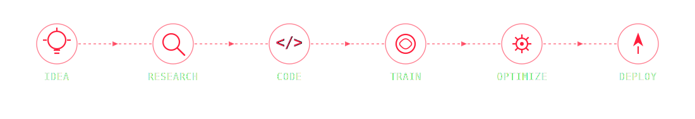

-------------------------------------------------------------------------------------------------------------


<div align="center">

# 🕸️ AI/ML Engineer 🕸️

### 🕸️ Swinging Through Code • Building Intelligent Systems • Saving Bugs One Commit at a Time 🕸️

<br>

<p>
 <b> 
 </b></p>

</div>

---
<div align="center">

## 🕸️ Connect Across the Spider-Verse 🕸️
<div align="center">
<a href="https://linkedin.com"></a>
<a href="https://instagram.com"></a>
<a href="mailto:yourmail@gmail.com"></a>
</div>

---

# 🕸️ Tech Stack 🕸️

<div align="center">

<br><br>

</div>
<br>
<div align="center">


</div>
</div>
---

# 🕷️ Spider-Verse Mission Log

```yaml
Alias: Friendly Neighborhood AI Engineer

Current Mission:
  🕸️ Building AI that solves real-world problems

Special Abilities:
  🧠 Machine Learning
  🤖 Deep Learning
  💬 NLP
  ⚡ Large Language Models
  🕸️ Retrieval-Augmented Generation
  👁️ Computer Vision

Status:
  🔥 On Patrol

Enemy:
  🐞 Bugs

Power Source:
  ☕ Coffee + Curiosity
```

---

# 🕸️ Hero Stats 🕸️
<div align="center">


<br><br>
<div align="center">


</div>

---

**"With great code comes great responsibility."**
# 🚀 Featured Projects
  -------------------------------------- ------------------------
  🤖 Enterprise AI Knowledge Assistant   RAG · LangChain · LLMs
  👁️ Face Recognition Attendance         OpenCV · Python
  📰 Fake News Detection                 NLP · Scikit-learn
  💬 Healthcare Chatbot                  Gemini · Streamlit
  🚗 Car Price Prediction                Machine Learning

------------------------------------------------------------------------

<div align="center">
<h3><b>"Every great AI project starts with a single commit."</b></h3>


</div>

<!-- <picture>
  <source media="(prefers-color-scheme: dark)" srcset="https://raw.githubusercontent.com/nikita17-n/nikita17-n/output/pacman-contribution-graph-dark.svg">
  <source media="(prefers-color-scheme: light)" srcset="https://raw.githubusercontent.com/nikita17-n/nikita17-n/output/pacman-contribution-graph.svg">
  
</picture>
--- -->


<p align="center">
  
</p>
