-------------------------------------------------------------------------------------------------------------



<div align="center">

# 🕸️ AI/ML Engineer 🕸️

### 🕸️ Swinging Through Code • Building Intelligent Systems • Saving Bugs One Commit at a Time 🕸️

<br>

<p>
 <b> 
 </b></p>

</div>

---

## 🕸️ Connect Across the Spider-Verse 🕸️

<p align="center">

<a href="https://linkedin.com">

</a>

<a href="https://instagram.com">

</a>

<a href="mailto:yourmail@gmail.com">

</a>

<a href="https://github.com/nikita17-n">

</a>

</p>

---

# 🕷️ Spider Suit Arsenal

<div align="left">
<div align="left">
</div>


<br><br>


</div>

---

# 🕷️ Spider-Verse Mission Log

```yaml
Alias: Friendly Neighborhood AI Engineer

Current Mission:
  🕸️ Building AI that solves real-world problems

Special Abilities:
  🧠 Machine Learning
  🤖 Deep Learning
  💬 NLP
  ⚡ Large Language Models
  🕸️ Retrieval-Augmented Generation
  👁️ Computer Vision

Status:
  🔥 On Patrol

Enemy:
  🐞 Bugs

Power Source:
  ☕ Coffee + Curiosity
```

---

# 🕸️ Hero Stats
<div align="center">


<br><br>


</div>

---

> **"With great code comes great responsibility."** 🕷️

### 🌠 Mission Stats

```yaml
⭐ Stars Collected: 156
🪐 Repositories Explored: 54
🔥 Warp Streak: 23 Days
👾 Open Source Missions: Active
````

---

# ⭐ GitHub Stats

<div align="center">


</div>

<div align="center">


</div>
---

<picture>
  <source media="(prefers-color-scheme: dark)" srcset="https://raw.githubusercontent.com/nikita17-n/nikita17-n/output/pacman-contribution-graph-dark.svg">
  <source media="(prefers-color-scheme: light)" srcset="https://raw.githubusercontent.com/nikita17-n/nikita17-n/output/pacman-contribution-graph.svg">
  
</picture>
---


<p align="center">
  
</p>
